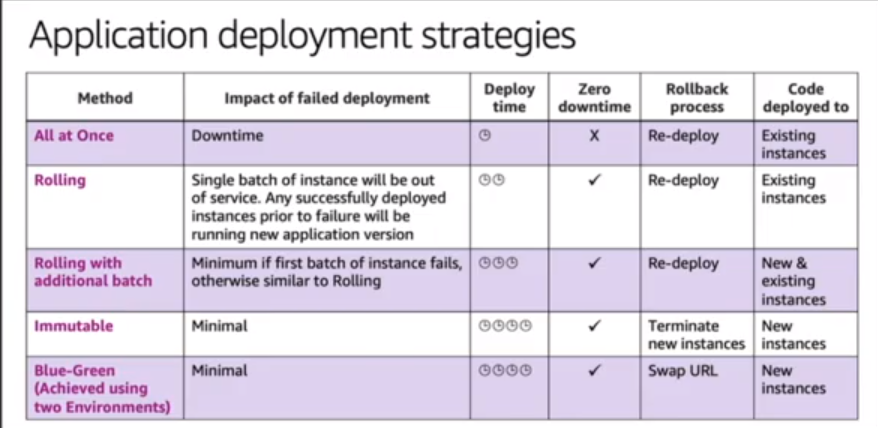

# Elastic BeanStalk
* [Elastic BeanStalk Concepts](https://docs.aws.amazon.com/elasticbeanstalk/latest/dg/concepts.html):
    * **Application**: Logical collection of EBS components like `environments`, `versions` and `environment configurations`. Conceptually similar to a  `FOLDER`.
    * **Application Version**: 
        * Refers to a specific, labeled iteration of deployable code for an application.
        * Points to an Amazon S3 object such as a Java WAR file.
    * **Environment**: 
        * Collection of AWS resources running an `Application Version`.
        * Can run only one Application Version at a time.
    * **Environment Tier**: 
        * [Web Server](https://docs.aws.amazon.com/elasticbeanstalk/latest/dg/concepts-webserver.html) - _Uses an ELB for Input_
        * [Worker](https://docs.aws.amazon.com/elasticbeanstalk/latest/dg/concepts-worker.html) - _Uses SQS Queue for Input_
    * **Environment Configuration**:
        * Collection of parameters and settings that define how an environment and its associated resources behave.
    * **Saved Configuration**: 
        * A template that you can use as a starting point for creating unique environment configurations.
    * **Platform**:
        * Combination of, 
            * Operating system
            * Programming language runtime 
            * Web server
            * Application server
            * Elastic Beanstalk components
* [**Deployment Policies**](https://docs.aws.amazon.com/elasticbeanstalk/latest/dg/using-features.rolling-version-deploy.html).
    * **Immutable** - Having new ASG alongside the old ASG running older version of software.
    * **Rolling** - Installing new software to subset of existing machines. 
    * **Rolling with additional batch** - Deploy new version in batches, but first launch a new batch of instance to ensure full capacity during the deployment process.
    * **Blue/Green** - Deploy new version to a separate environment and swap CNAME's to redirect traffic to newer version.
    * **All at once** - Results in a short downtime as all the existing instances are taken out of service and new version is installed.
    
    
    
     
