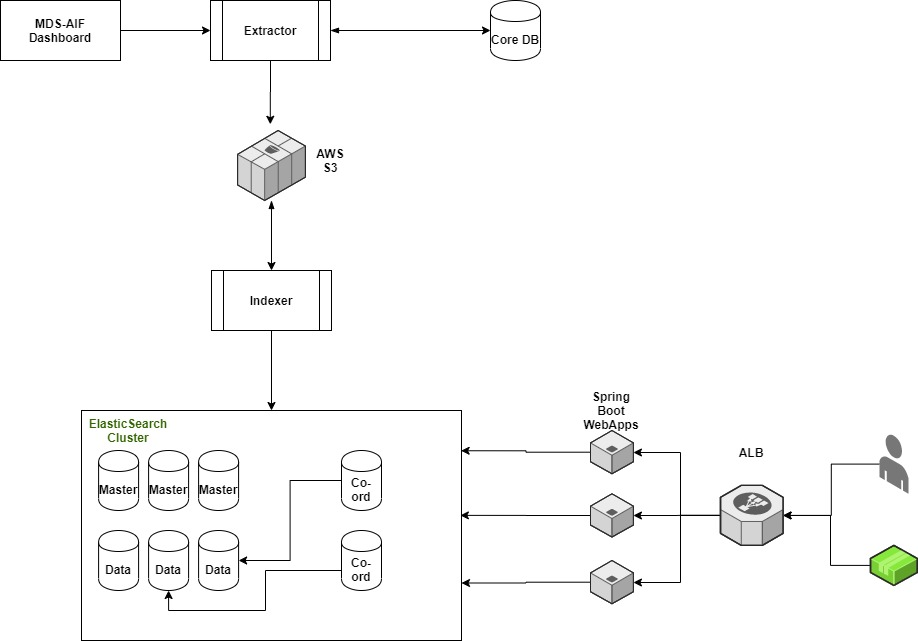

# Geocoder

##### Performance Issues:
* **Stage-1:**
    * Routing (Specify at index/query time, Single ES Index) -> Shard was too heavy/large ~500GB (Recommended was, 30 GB)
    * Increasing shards did not help as single dataset was too large.
    * Increasing data node too didn't help.
* **Stage-2:**     
    * Tried multiple index approach,
        * Country wise 3 indexes,
            * APT
            * RoadElement
            * Others
        * **Index names:** ny-anchorpoint-0, ny-roadelement-0, ny-others-0
        * **Aliases**: ny, ny-anchorpoint, anchorpoint `-->`
           ny-anchorpoint-0
        * Aliases were introduced,
            * _**To enable hot swap (without downtime)**_
                * New indexes for a given data set are built independently, once built, aliases are directed to these newly created indexes.
                * For example, when building new indexes for ny (new york) data set:
                    * Current aliases and index mapping is as follows:
                        *  ny `-->` ny-anchorpoint-0, ny-roadelement-0, ny-others-0
                        *  ny-anchorpoint `-->` ny-anchorpoint-0
                        *  anchorpoint `-->` ny-anchorpoint-0, ... *
                        *  ny-roadelement `-->` ny-roadelement-0
                        *  roadelement `-->` ny-roadelement-0, ... *
                    * Once new indexes are build above aliases will point to newly created indexes for ny, i.e. `ny-anchorpoint-1, ny-roadelement-1, ny-others-1` 
            * **_To enable search_**,
                * ny 
                   * ny-anchorpoint, ny-roadelement, ny-others
                * anchorpoint
                   * <data_set>-anchorpoint-<seq_num>
                * roadelement
                   * <data_set>-roadelement-<seq_num>            
        * To reduce search scope 
        * Country wise mapping & settings flexibility
        * To avoid downtime (older dataset is available when newer is getting indexed)
* Yellow State Problem
* Coordinating node OOM error:
    * Bug in Open JDK-8 -> Default **NewRatio** is ignored when UseConcMarkSweepGC is used as GC algorithm
    * https://bugs.openjdk.java.net/browse/JDK-8153578
    * **Workaround**: 
        * Explicitly passing -XX:NewRatio=2
* **RAID-0 for Extractor Nodes:** https://cloudacademy.com/blog/amazon-aws-raid-0-configuration-on-ebs-volumes/

